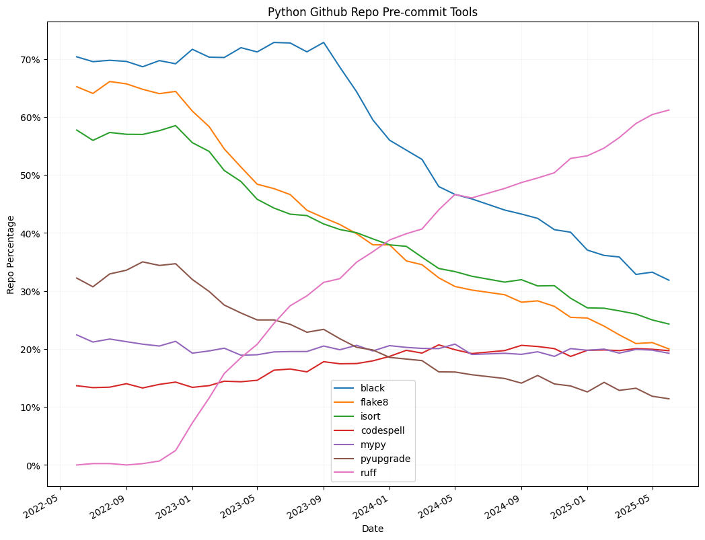
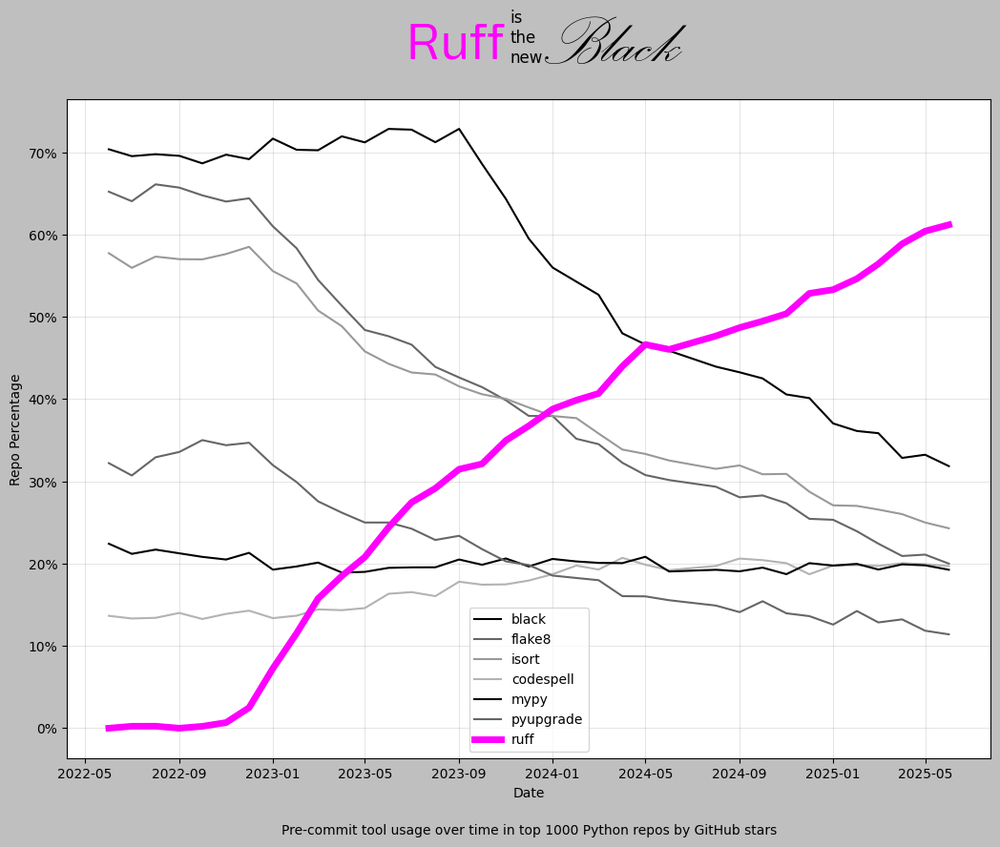

# Ruff Adoption Analysis

Analysis of Ruff Adoption via Github pre-commit-configs

## Introduction

This is an analysis and visualisation of the Ruff linter and formatter tool (specifically ruff-pre-commit) adoption I performed on 8th Nov 2023 by scraping the .pre-commit-config.yaml files of the top 1000 most popular (by star count) Python Github repos (that used a pre-commit-config.yaml, and had existed since the beginning of June 2022).

Two Jupyter notebooks are included I used to produce the above plot:

- collect_data.ipynb - this notebook uses pyGithub to scrape the repo data and save historical .pre-commit-config.yaml files (one per month, per repo)
- analyse_results.ipynb - this notebook aggregates the counts of repos that use a particular pre-commit tool to produce the above plot

Additional notes on the usage of the notebooks is included in the notebooks themselves.

### Update

Re-ran the data collection and analysis on 3 Mar 2024 to take the results up to the end of Feb 2024.

## Motivation

I'd observed a lot of positive sentiment around [Ruff](https://github.com/astral-sh/ruff) - the Python linter and formatter tool which I too shared. But when it came to convincing others that Ruff was a good tool to adopt I had no quantiative evidence to back up the idea that it was gaining a lot of market/repo share. To address that I thought a (relatively) easy way was to monitor trends in pre-commit tool use over time in popular Python Github repos.

## Results / Discussion

I'd heard anecdotally that Ruff was _eating the other Python linters and formatters lunch_ - and I was pleased this plot showing the share of the 1000 most popular Python repos each tool has been used in over time appears to back up that idea. As Ruff encompasses the rule sets of so many other Python linters (probably the most popular competitor being Flake8) it does seem to be taking market share at their expense (I had observed several high profile Python repos PRs making this transition to Ruff so I was pretty confident this would be the case). At the time of writing Ruff-formatter (which offers near equivalent functionality to Black) has only recently gone into Beta and been recommended for production use. I expect if this analysis is followed up in several more months we may see Black also start to lose ground relative to Ruff as isort already has (to a degree).

## Limitations / Further Possible Work

I chose to analyse pre-commit-config.yaml files since that is a single file per repo almost always in the root of the repo which made it ideal for analysis. There's lots of popular Python repo that use different continuous integration workflow tools and this analysis completely misses those repos. In the case of GitHub specifically analysing the Github action configuration files may be more comprehensive way to monitor usage (but I suspect technically a lot more complicated to implement). Even in the case of pre-commit-config.yaml files since they can execute tools via scripts, or installed in different ways, even in this _simple case_ I resorted to some heuristic rule (see analyse_results.ipynb) to guess at what tool was actually being executed.
